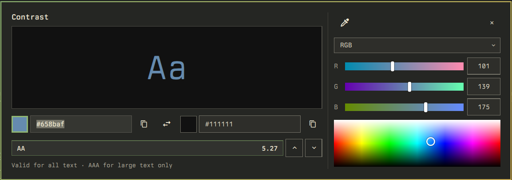

# omarchy-contrast

A colour contrast checker for [Omarchy](https://omarchy.org), in the spirit of
[Contrast](https://usecontrast.com) by MDS. It runs as an overlay inside the
Omarchy shell: pick a foreground and a background, get the WCAG 2 contrast
ratio and conformance level instantly.



- Live preview of the pair with the contrast ratio and conformance level
  (**AAA** ≥ 7, **AA** ≥ 4.5, **AA Large** ≥ 3, otherwise **Fail**)
- Eyedropper for either colour (via `hyprpicker`)
- Colour picker drawer with **RGB**, **HSL**, **OKLCH** and **Greyscale** sliders
  and a hue × lightness map
- ↑ / ↓ nudge the colour lighter or darker by 1 % (Shift for 10 %)
- Copy either hex to the clipboard
- Styled entirely from the active Omarchy theme

## Install

```sh
omarchy plugin add https://github.com/LoamStudios/omarchy-contrast.git --enable
```

Then open it with:

```sh
omarchy-shell shell toggle loamstudios.contrast
```

Optionally preload a pair:

```sh
omarchy-shell shell toggle loamstudios.contrast '{"fg":"#658baf","bg":"#111111"}'
```

### Launcher, menu entry and keybinding

`bin/omarchy-contrast` is a small wrapper around the toggle call. Copy it onto
your `PATH` (for example `~/.local/bin`) and you can run `omarchy-contrast`,
or `omarchy-contrast '#fg' '#bg'`.

Add it to the Omarchy menu in `~/.config/omarchy/extensions/omarchy-menu.jsonc`:

```jsonc
"trigger.contrast": {"icon":"󰏘","label":"Contrast","aliases":["contrast","wcag"],"action":"omarchy-contrast"},
```

And bind a key in `~/.config/hypr/bindings.lua`:

```lua
o.bind("SUPER + CTRL + U", "Contrast checker", "omarchy-contrast")
```

## Remove

```sh
omarchy plugin remove loamstudios.contrast
```

To keep the plugin installed but switch it off, use `omarchy plugin disable
loamstudios.contrast`. If you copied `bin/omarchy-contrast` onto your `PATH`,
delete it, and remove the menu entry and keybinding you added above.

## Keys

| Key | Action |
| --- | --- |
| `Esc` | Close the picker drawer, then the overlay |
| `Tab` | Move between the hex fields |
| `Ctrl+F` / `Ctrl+B` | Eyedropper for foreground / background |
| `Shift+X` | Swap foreground and background |
| `↑` / `↓` | Lighten / darken the focused colour by 1 % (`Shift` for 10 %) |

Click a swatch to open the picker drawer for that colour.

## Files

- `manifest.json` — Omarchy shell plugin manifest (`kinds: ["overlay"]`)
- `Contrast.qml` — the overlay
- `Contrast.js` — colour maths: WCAG 2, APCA, OKLab/OKLCH, HSV/HSL, IPC schema
- `scripts/run-capped.sh` — allowlisted `/usr/bin` launcher with byte caps
- `bin/omarchy-contrast` — launcher wrapper

## Requirements

Omarchy with the Quickshell-based shell, `hyprpicker`, and `wl-clipboard`
(all part of a stock Omarchy install).

## License

MIT © Loam Studios
